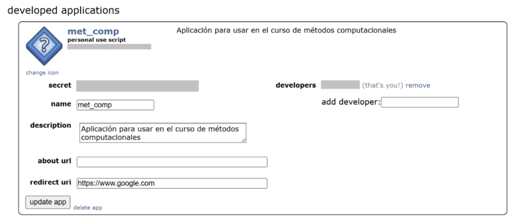

```{r}
#| echo: false
#| output: false
library(reticulate)
py_install(c("pandas", "praw", "python-dotenv"))
```

# Introducción

Reddit es una de las plataformas digitales más relevantes para la comunicación y discusión dentro de la Generación Z. Esta ofrece comunidades específicas (subreddits) que permiten al usuario crear, compartir y discutir contenido, y un ambiente de relativo anonimato donde se puede interactuar con contenido sensible y delicado. Siguiendo lo anterior, Reddit se vuelve una fuente valiosa de información sobre experiencias y discusiones en torno a diversas temáticas (Stang et al, 2025).

En este sentido, entendiendo que hoy en día la mayoría de las interacciones sociales se dan de forma digital, tanto el género como la sexualidad se comienzan a construir dentro de este ambiente. Así, los sujetos viven procesos de validación, pugna y normalización a través de las interacciones online con un otro globalizado. En consecuencia, el lenguaje, como expresión identitaria, también se construye a través de este medio, produciendo y reproduciendo roles y estereotipos de género. Esto refuerza las normas sociales y expectativas vinculadas a la identidad de género. (Criado et al, 2021; Sawicki & Solska, 2024; Scholz et al, 2025).

Con respecto a lo anterior, la relevancia sociológica de estudiar el género a través del lenguaje y las interacciones dentro de una plataforma digital como Reddit surge debido a la importancia que cumplen las redes sociales como principal espacio de socialización y construcción del género hoy en día. Además, este permite identificar y examinar discursos sesgados y dominantes, como también la producción y reproducción de estereotipos y roles. Así, se logra visibilizar la construcción del género a través de patrones sociolingüísticos y comunicativos. Por último, posibilita distinguir los diferentes perfiles de usuarios al interactuar con contenido propiamente ligado al género. A partir de esto, se formuló la siguiente pregunta de investigación: ¿Qué diferencias discursivas existen en torno al género en los comentarios de los usuarios de los subreddit r/AskMen y r/AskWomen en Reddit?

En el transcurso de la investigación se extraerá información de los subreddits de r/AskMen y r/AskWomen. Estos datos permiten, en primer lugar, una comparación y análisis de contenido a partir del género; en segundo lugar, un análisis cruzado, es decir, de qué se habla con respecto al género opuesto en cada subreddit; y, por último, un análisis de los diferentes perfiles de usuarios que interactúan en estos foros con respecto a su género e identidad. De esta forma, el estudio busca no solo identificar diferencias en los discursos de género entre ambos subreddits, sino también analizar las representaciones del género opuesto y los perfiles sociolingüísticos de los usuarios que participan en estas comunidades.

# Fuente de información

La fuente de información donde se extrajeron los datos fue Reddit, específicamente los subreddits de r/AskMen y r/AskWomen.

AskMen fue creado el 30 de agosto de 2010. Es un espacio con alrededor de 2 millones de miembros y una participación activa de 41 mil contribuciones semanales. Su lema es “a place to discuss men’s experience”, demostrando ser un lugar para discutir y compartir vivencias desde la perspectiva masculina.

AskWomen, creado el 17 de julio de 2010, cuenta con más de 946 mil suscriptores y alrededor de 14 mil usuarios activos. Su propósito declarado es ofrecer un espacio donde las mujeres puedan responder con comodidad y sinceridad a preguntas sobre sus pensamientos, vidas y experiencias. Se enfatiza en el respeto y la ausencia de juicios, lo que lo convierte en un entorno distinto al de AskMen, con un enfoque más regulado hacia el tono y los temas de discusión.

Para la extracción de información de estos subreddits se utilizó la API de Reddit, mediante la librería PRAW. Esta herramienta permite automatizar la recolección de publicaciones y comentarios, asegurando un volumen considerable de datos y facilitando su análisis.

# Tutorial

## Extracción de información: API de Reddit

Como primer paso, fue necesario inscribir una aplicación para poder utilizar la API de Reddit. En el siguiente [enlace](https://rymur.github.io/setup) se encuentra un tutorial detallado sobre cómo crear un app. A continuación, se muestra un ejemplo:

{fig-align="center" width="80%"}

## Autenticación con PRAW

Para interactuar con la API se trabajará en python, aprovechando las herramientas que ofrece este lenguaje. En este caso, se usa Positron como entorno de trabajo.

El primer paso consiste en importar las librerías necesarias: praw, datetime, pandas, dotenv y os.

```{python}
import praw
from datetime import datetime
import pandas as pd # para manipulación de dataframes
from dotenv import load_dotenv # cargar variables de ambiente
import os # cargar variables de ambiente
```

Además, se requiere crear un text file con extensión .env donde se almacenan las credenciales de acceso. Si las variables dentro de este archivo se cargan correctamente, la función load_dotenv() devuelve True.

```{python}
#| output: false
load_dotenv()
```

Con lo anterior listo, se definen las variables que contienen los tokens del archivo .env. Las credenciales necesarias para la autenticación son: client_id, client_secret y user_agent.

```{python}
#| eval: false
client_id = os.getenv('CLIENT_ID')
client_secret = os.getenv('CLIENT_SECRET')
username = os.getenv('USERNAME')
password = os.getenv('PASSWORD')
user_agent = os.getenv('USER_AGENT')
auth_url = "https://www.reddit.com/api/v1/access_token"
```

Finalmente, mediante la función reddit de praw, se realiza la conexión con la API utilizando las credenciales guardadas.

```{python}
#| eval: false
reddit = praw.Reddit(
    client_id=client_id,
    client_secret=client_secret,
    user_agent=user_agent
)
```

## Proceso de extracción de datos

La extracción de datos se hizo a partir del los subreddits de r/AskMen y r/AskWomen. Para asegurar una cantidad de datos robusta, se sugiere una revisión sistemática de los subreddit y establecer criterios de extracción de datos.

### Proceso de extracción de datos: r/AskMen

En primer lugar, se creó una variable que contiene el subreddit de donde se quiere extraer la información y una lista vacía para contener los comentarios de cada publicación

```{python}
#| eval: false
subreddit_askmen = reddit.subreddit("AskMen")
comentarios_askmen = []
```

Posteriormente, se creó un for anidado. El primero refiere a la publicación, las cuales se filtraron las top por día, con un límite de 1000. El segundo, corresponde a los comentarios de cada publicación; para esto, se tuvo que añadir una línea de código para también extraer los códigos que están abajo del view more.

De esta forma, se recolectaron todos los comentarios de cada publicación del día en el subreddit. Además, la variable de tiempo se transformó de unix timestamp a datetime, lo que facilita su interpretación y análisis posterior.

```{python}
#| eval: false
#| output: false
for submission in subreddit_askmen.top(time_filter="day", limit=1000):
    submission.comments.replace_more(limit=None)


    for comment in submission.comments:
        askmen = [
            subreddit_askmen,
            submission.author,
            submission.id,
            submission.title,
            submission.num_comments,
            submission.over_18,                
            submission.score,              
            comment.author,
            comment.id,
            comment.body,
            comment.score,
            datetime.fromtimestamp(comment.created_utc)                    
        ]
        comentarios_askmen.append(askmen)

```

Finalmente, se creó un dataframe que contiene las variables extraídas, asignándoles nombres para su identificación. A cada base de datos diaria se les asignó un nombre con el formato “nombresubreddit_fecha”, lo que permite organizarlas por día. Para efectos de este tutorial, los nombres de las bases de datos serán fecha "xxxx".

```{python}
#| eval: false
askmen_xxxx = pd.DataFrame(
    comentarios_askmen,
    columns=["subreddit_nombre", "submission_autor", "submission_id", "submission_titulo",
     "submission_numcom", "submission_NSFW", "submission_puntaje",
     "comentario_autor", "comentario_id", "comentario_body", "comentario_puntaje", "comentario_fecha"]
)


askmen_xxxx.to_csv("askmen_xxxx.csv", index=False)
```

### Proceso de extracción de datos: r/AskWomen

El procedimiento se repitió de la misma manera, solamente cambiando el subreddit a r/AskWomen.

```{python}
#| eval: false
#| #| output: false
subreddit_askwomen = reddit.subreddit("AskWomen")
comentarios_askwomen = []


for submission in subreddit_askwomen.top(time_filter="day", limit=1000):
    submission.comments.replace_more(limit=None)


    for comment in submission.comments:
        askwomen = [
            subreddit_askwomen,
            submission.author,
            submission.id,
            submission.title,
            submission.num_comments,
            submission.over_18,                
            submission.score,              
            comment.author,
            comment.id,
            comment.body,
            comment.score,
            datetime.fromtimestamp(comment.created_utc)                    
        ]
        comentarios_askwomen.append(askwomen)


askwomen_xxxx = pd.DataFrame(
    comentarios_askwomen,
    columns=["subreddit_nombre", "submission_autor", "submission_id", "submission_titulo",
     "submission_numcom", "submission_NSFW", "submission_puntaje",
     "comentario_autor", "comentario_id", "comentario_body", "comentario_puntaje", "comentario_fecha"]
)


askwomen_xxxx.to_csv("askwomen_xxxx.csv", index=False)
```

## Unión de BBDD para procesamiento

A partir de este punto se comienza a trabajar con R, con el objetivo de facilitar la manipulación y visualización de datos. Para ello, se requiere instalar las liberías: dplyr, readr, tidyr, ggplot2, stringr y gt. Además, se evita la notación científica en los resultados y se limpia el entorno de trabajo.

```{r}
#| output: false
library(dplyr)     # Manipular datos 
library(readr)     # Leer datos 
library(tidyr)     # Tratamiento datos
library(ggplot2)   # Gráficos
library(stringr)   # Trabajar con texto
library(gt)        # Tablas

options(scipen = 999)
rm(list = ls())
```

Posteriormente, se cargan las BBDD guardadas en formato .csv y se unen todas en un único archivo denominado datos_ask. En caso de contar con más de un día de extracción, cada nueva base se debe ir incorporando de la misma manera. Finalmente, la base consolidada se guarda en un archivo con la función write_csv, lo que permite avanzar hacia el procesamiento de datos.

```{r}
#| eval: false
askmen_xxxx <- read_csv("askmen_xxxx.csv")
askwomen_xxxx <- read_csv("askwomen_xxxx.csv")

datos_ask <- bind_rows(askmen_xxxx, askwomen_xxxx)

write_csv(datos_ask, "datos_ask.csv")
```

## Procesamiento de BBDD en R

A partir de la base de datos consolidada se generó una versión procesada con nombre datos_ask_proc. En esta etapa se realizaron distintas transformaciones para mejorar la calidad de la información:

i)  la variable submission_NSFW fue recodificada de valores lógicos (False y True) a 0 y 1.
ii) la variable comentario_fecha se separó en fecha y hora, y se filtraron los días con menos de 100 observaciones.
iii) se filtraron los días con menos de 100 observaciones.
iv) Se filtraron las publicaciones que no obtuvieron comentarios.
v)  La variable fecha se reconoce como tipo date.

El resultado de este procesamiento corresponde a una base depurada, almacenada como datos_ask_proc.csv, que será la BBDD principal para el análisis posterior.

```{r}
#| eval: false
datos_ask_proc <- datos_ask %>%
  mutate(submission_NSFW = case_when(
    submission_NSFW == "FALSE" ~ 0,
    submission_NSFW == "TRUE" ~ 1)) %>%
  separate(comentario_fecha, into = c("comentario_fecha", "comentario_hora"), sep = " ") %>%
group_by(comentario_fecha)%>%
  filter(n() > 100) %>%
  ungroup()%>%
group_by(submission_id) %>%
  filter(n() > 1)


as.Date(datos_ask_proc$comentario_fecha)


write_csv(datos_ask_proc, "datos_ask_proc.csv")
```

# Análisis

```{r}
#| echo: false
#| output: false

#Cargar BBDD procesada
datos_ask_proc <- read_csv("data/datos_ask_proc.csv")
```

```{r}
#| echo: false
#| output: false

#chunk tabla 1:

# Tabla: cantidad de comentarios por día y subreddit
tabla_comentarios_por_dia <- datos_ask_proc %>%
  group_by(comentario_fecha, subreddit_nombre) %>%
  summarise(
    comentarios = n_distinct(comentario_id), 
    .groups = "drop"
  ) %>%
  arrange(comentario_fecha)


total_comentarios <- tibble(
  comentario_fecha = as.Date(NA),   
  subreddit_nombre = "Total",
  comentarios = sum(tabla_comentarios_por_dia$comentarios, na.rm = TRUE)
)

tabla_con_total <- bind_rows(tabla_comentarios_por_dia, total_comentarios)

# Tabla final en gt
tabla1 <- tabla_con_total %>%
  gt() %>%
  tab_header(
    title = "Tabla 1: Comentarios por día",
    subtitle = "Cantidad de comentarios únicos en r/AskMen y r/AskWomen"
  ) %>%
  cols_label(
    comentario_fecha = "Fecha",
    subreddit_nombre = "Subreddit",
    comentarios = "Comentarios"
  ) %>%
  fmt_number(
    columns = comentarios,
    decimals = 0,
    use_seps = TRUE
  ) %>%
  tab_options(
    table.width = pct(100),
    table.align = "center"
  )


```

```{r}
#| echo: false
#| output: false
 
 #chunk tabla 2:

# Tabla: estadísticos descriptivo de comentarios por subreddit
descriptivos_comentarios <- tabla_comentarios_por_dia %>%
  group_by(subreddit_nombre) %>%
  summarise(
    media = mean(comentarios, na.rm = TRUE),
    minimo = min(comentarios, na.rm = TRUE),
    maximo = max(comentarios, na.rm = TRUE),
    .groups = "drop"
  )


tabla2 <- descriptivos_comentarios %>%
  gt() %>%
  tab_header(
    title = "Tabla 2: Estadísticos descriptivos",
    subtitle = "Descriptivos de comentarios diarios por subreddit"
  ) %>%
  cols_label(
    subreddit_nombre = "Subreddit",
    media   = "Media",
    minimo  = "Mínimo",
    maximo  = "Máximo"
  ) %>%
  fmt_number(
    columns = c(media, minimo, maximo),
    decimals = 0,
    use_seps = TRUE
  ) %>%
  tab_options(
    table.width = pct(100),  
    table.align = "center"    
  )

```

```{r}
#| echo: false
#| output: false

#Bases de datos para gráficos:

#--- Base de datos solo subreddits
datos_ask_subreddit <- datos_ask_proc %>%
  group_by(comentario_fecha, subreddit_nombre) %>%
  summarise(
    submission_cantidad = n(),
    submission_puntaje = mean(submission_puntaje),
    submission_NSFW = sum(submission_NSFW)
  ) %>%
  ungroup() %>%
  mutate(comentario_fecha = as.Date(comentario_fecha)) %>%
  arrange(comentario_fecha, subreddit_nombre)


#--- Base de datos solo titulos
datos_ask_titulo <- datos_ask_proc %>%
  group_by(submission_id) %>%
  summarise (subreddit_nombre = first(subreddit_nombre),
             submission_autor = first(submission_autor),
             submission_id = first(submission_id),
             submission_titulo = first(submission_titulo),
             submission_numcom = first(submission_numcom),
             submission_puntaje = first(submission_puntaje),
             submission_NSFW = first(submission_NSFW),
             comentario_fecha = first(comentario_fecha),
             .groups = "drop"    
  )

#Gráficos

#--- Actividad de comentarios por día en cada subreddit----
graf1 <- ggplot(datos_ask_subreddit, aes (x=comentario_fecha, y=submission_cantidad, color = subreddit_nombre)) +
  geom_line(size = 1) +  
  geom_point(size = 3) +  
  scale_y_continuous(limits = c(0,2500), breaks = seq(0,2500, by = 250)) +
  labs(
    title = "Gráfico 1: Actividad de comentarios por día",
    subtitle = "Comparación entre r/AskMen y r/AskWomen",
    x = "Fecha",
    y = "Cantidad de comentarios",
    color = "Subreddit"
  ) +
  theme_minimal() +
  scale_color_manual(values = c("AskMen" = "#1f77b4",  
                               "AskWomen" = "#d62728"))


#--- Distribución del puntaje de las publicaciones en cada subreddit-----
graf2 <- ggplot(datos_ask_titulo, aes(x = subreddit_nombre, y = submission_puntaje, fill = subreddit_nombre)) +
  geom_violin(trim = FALSE, alpha = 0.6) +
  geom_boxplot(width = 0.1, fill = "white") +
  scale_y_log10() +
  labs(
    title = "Gráfico 2: Distribución del puntaje de publicaciones",
    subtitle = "Comparación puntaje (upvotes y downvotes) entre r/AskMen y r/AskWomen",
    x = "Subreddit",
    y = "Puntaje (ln)"
  ) +
  theme_minimal() +
  scale_fill_manual(values = c("AskMen" = "#1f77b4",  
                               "AskWomen" = "#d62728"))

```

```{r}
#| echo: false
#| output: false


# Análisis nsfw

nsfw_total <- datos_ask_subreddit %>%
  group_by(subreddit_nombre) %>%
  summarise(
    total_nsfw = sum(submission_NSFW, na.rm = TRUE),
    .groups = "drop"
  )

graf3 <- ggplot(nsfw_total, aes(x = subreddit_nombre, y = total_nsfw, fill = subreddit_nombre)) +
  geom_col(alpha = 0.8, width = 0.6) +
  geom_text(aes(label = total_nsfw),
            vjust = -0.5,        
            fontface = "bold") + 
  labs(
    title = "Gráfico 3: Cantidad de comentarios en publicaciones NSFW",
    subtitle = "Comparación entre r/AskMen y r/AskWomen",
    x = "Subreddit",
    y = "Número de comentarios en publicaciones NSFW"
  ) +
  scale_fill_manual(values = c("AskMen" = "#1f77b4",  
                               "AskWomen" = "#d62728")) +
  theme_minimal()


```

## Variables

La base de datos procesada contiene un conjunto de variables que permite describir y analizar los contenidos de las publicaciones y comentarios de los subreddits a estudiar. En la siguiente tabla se presentan todas las variables incluidas en el análisis descriptivo, junto con una breve definición de su contenido y función dentro del dataset.

```{r}
#| echo: false
#| output: false

variables_info <- tibble::tribble(
  ~Variable, ~Definición,
  "subreddit_nombre", "Nombre del subreddit de donde proviene la publicación (AskMen o AskWomen).",
  "submission_autor", "Usuario que creó la publicación original.",
  "submission_id", "Identificador único de la publicación en Reddit.",
  "submission_titulo", "Título de la publicación realizada en el subreddit.",
  "submission_numcom", "Número total de comentarios que recibió la publicación.",
  "submission_NSFW", "Indica si la publicación fue marcada como NSFW (Not Safe For Work)  (0=no, 1=sí).",
  "submission_puntaje", "Puntaje total de la publicación (upvotes – downvotes).",
  "comentario_autor", "Usuario que escribió el comentario.",
  "comentario_id", "Identificador único de cada comentario en Reddit.",
  "comentario_body", "Texto completo del comentario.",
  "comentario_puntaje", "Puntaje del comentario (upvotes – downvotes).",
  "comentario_fecha", "Fecha en que se realizó el comentario (formato día-mes-año).",
  "comentario_hora", "Hora en que se realizó el comentario."
)

tabla_variables <- variables_info %>%
  gt() %>%
  tab_header(
    title = md("**Variables incluidas en el análisis**"),
    subtitle = "Definición de cada variable del dataset procesado"
  ) %>%
  cols_label(
    Variable = "Variable",
    Definición = "Definición"
  ) %>%
  tab_options(
    table.font.size = px(13),
    row.striping.include_table_body = TRUE,
    table.width = pct(100),
    table.align = "center"
  )

```

```{r}
#| echo: false

 tabla_variables
```

## Análisis descriptivo

En la Tabla 1 se muestra la cantidad de comentarios en cada extracción por día y subreddit. Luego del procesamiento, el total de la base asciende a N = 9.085 comentarios. Como se observa en el Gráfico 1, la actividad diaria es consistentemente mayor en AskMen que en AskWomen, con una diferencia marcada que se mantiene a lo largo de los días analizados.

```{r}
#| echo: false
tabla1
```

<br>

```{r}
#| echo: false
graf1
```

<br><br> La Tabla 2 presenta los estadísticos descriptivos de la cantidad de comentarios diarios. El promedio de AskMen (1.833) es más de cuatro veces superior al de AskWomen (438). Esto implica que, en promedio, por cada comentario en AskWomen, se registran cuatro en AskMen. Además, la variabilidad es mayor en AskMen, con un rango que llega hasta más de 2.000 comentarios, lo que indica mayor heterogeneidad en la actividad de este subreddit.

```{r}
#| echo: false
tabla2
```

<br><br>

Respecto a las puntuaciones de las publicaciones, el Gráfico 2 evidencia una distribución con valores extremos más pronunciados en AskMen, donde aparecen publicaciones con puntajes considerablemente altos. En AskWomen, en cambio, las puntuaciones tienden a concentrarse en un rango más reducido, lo que sugiere un comportamiento más homogéneo en las interacciones de los usuarios.

```{r}
#| echo: false
#| warning: false
graf2
```

<br><br>

En el caso del contenido marcado como NSFW (Not Safe For Work), el Gráfico 3 muestra una diferencia significativa: en AskMen se contabilizan 470 comentarios en publicaciones NSFW, mientras que en AskWomen son solo 127. Este resultado refuerza la idea de que AskMen concentra una mayor proporción de interacciones asociadas a material sensible o explícito.

```{r}
#| echo: false
graf3
```

## Directrices de investigación

Para la investigación a futuro, se busca realizar un análisis específico de contenido con respecto al género. Por ejemplo, de insultos, contenido sexual, emociones, entre otros.

En el Gráfico 4 se presenta un análisis preliminar sobre el uso de insultos hacia hombres y mujeres en los comentarios. En ambos subreddits se observa la presencia de lenguaje ofensivo, pero destaca que en AskMen se identifican más insultos dirigidos tanto a hombres (58,2%) como a mujeres (41,8%). En AskWomen, en cambio, los insultos aparecen en menor frecuencia, aunque con un sesgo marcado hacia insultos de carácter masculino (70%).

```{r}
#| echo: false
#| output: false

#Crear lista de insultos y análisis

insultos_AskMen <- datos_ask_proc %>%
  filter(subreddit_nombre == "AskMen")

insultos_AskWomen <- datos_ask_proc %>%
  filter(subreddit_nombre == "AskWomen")

# Lista de insultos hacia hombres
palabras_insultos_hombre <- paste(c(
  "\\bfag(s|got)?\\b", "\\bgay\\b", "\\bpussy\\b", "\\bsimp\\b", 
  "\\bbeta\\b", "\\bcuck\\b", "\\bloser\\b", "\\bsoyboy\\b", 
  "\\bincel\\b", "\\bdickhead\\b", "\\basshole\\b", "\\bprick\\b", 
  "\\bwimps?\\b", "\\bweaklings?\\b", "\\bbitch\\b"
), collapse = "|")

# Lista de insultos hacia mujeres
palabras_insultos_mujer <- paste(c(
  "\\bsluts?\\b", "\\bwhores?\\b", "\\bhoes?\\b", "\\bskanks?\\b", "\\bthots?\\b", 
  "\\bbitch(es)?\\b", "\\bcunts?\\b", "\\bhags?\\b", "\\bgold ?diggers?\\b", "\\bhookers?\\b", 
  "\\bslappers?\\b", "\\bwenches?\\b", "\\btramps?\\b", "\\bcows?\\b", "\\bnags?\\b"
), collapse = "|")

# Insultos hacia hombres en cada subreddit
insultos_hombre_AskMen <- sum(
  str_count(insultos_AskMen$comentario_body, regex(palabras_insultos_hombre, ignore_case = TRUE))
)

insultos_hombre_AskWomen <- sum(
  str_count(insultos_AskWomen$comentario_body, regex(palabras_insultos_hombre, ignore_case = TRUE))
)

# Insultos hacia mujeres en cada subreddit
insultos_mujer_AskMen <- sum(
  str_count(insultos_AskMen$comentario_body, regex(palabras_insultos_mujer, ignore_case = TRUE))
)

insultos_mujer_AskWomen <- sum(
  str_count(insultos_AskWomen$comentario_body, regex(palabras_insultos_mujer, ignore_case = TRUE))
)

# Data frame con los resultados
datos_insultos <- data.frame(
  subreddit_nombre = c("AskMen", "AskWomen", "AskMen", "AskWomen"),
  tipo_insultos = c("Masculinos", "Masculinos", "Femeninos", "Femeninos"),
  cantidad = c(insultos_hombre_AskMen, insultos_hombre_AskWomen,
               insultos_mujer_AskMen, insultos_mujer_AskWomen)
)

datos_insultos <- datos_insultos %>%
  group_by(subreddit_nombre) %>%
  mutate(porcentaje = round(100 * cantidad / sum(cantidad), 1)) %>%
  ungroup()

graf4 <- ggplot(datos_insultos, aes(x = tipo_insultos, y = cantidad, fill = subreddit_nombre)) +
  geom_col(position = position_dodge(), color = "black") +
  geom_text(aes(label = paste0(cantidad, " (", porcentaje, "%)")),
            position = position_dodge(width = 0.9), vjust = -0.3, size = 3) +
  labs(
    title = "Gráfico 4: Cantidad de insultos por género y subreddit",
    subtitle = "Se muestran cantidades absolutas y porcentaje relativo",
    x = "Tipo de insultos",
    y = "Cantidad",
    fill = "Subreddit"
  ) +
  theme_minimal() +
  scale_fill_manual(values = c("AskMen" = "#1f77b4", "AskWomen" = "#d62728"))

```

```{r}
#| echo: false
graf4
```

# Conclusión

A modo de síntesis, se puede señalar que la actividad en AskMen es mucho mayor que en AskWomen, con cerca de cuatro veces más comentarios diarios. Además, las publicaciones en AskMen presentan puntajes más extremos, mientras que en AskWomen tienden a concentrarse en un rango más homogéneo.

El contenido NSFW es más frecuente en AskMen, lo que refleja diferencias en las formas discursiva de cada comunidad.

Finalmente, los insultos aparecen con mayor intensidad en AskMen, tanto hacia hombres como hacia mujeres. En AskWomen son menos frecuentes, aunque con un sesgo hacia insultos dirigidos a lo masculino.

En conjunto, AskMen se caracteriza por un volumen de interacciones más alto, dinámicas discursivas más polarizadas, reflejado en sus puntajes, y mayor presencia de lenguaje sensible, mientras que AskWomen muestra menor actividad y un discurso más homogéneo.

# Referencias bibliográficas

Criado, N., Ferrer, X., Such, J. & Van Nuenen, T. (2021). Discovering and Categorising Language Biases in Reddit. *Proceedings of the International AAAI Conference on Web and Social Media, 15*(1), 140-151. <https://doi.org/10.1609/icwsm.v15i1.18048> 

Sawicki, J. & Solska, D. (2024). Decoding gender bias through a textual exploration of Reddit /r/MensRights community. Beyond Philology, 1(21), 167-202. <https://doi.org/10.26881/bp.2024.1.06>

Scholz, S., Stang, P., Weiss, M. & Winkler, C. (2025). Changing Conversations: The Rise of Gender and Sexuality Discourse on Reddit. *Arch Sex Behav, 54*, 1–5. <https://doi.org/10.1007/s10508-024-03051-9>