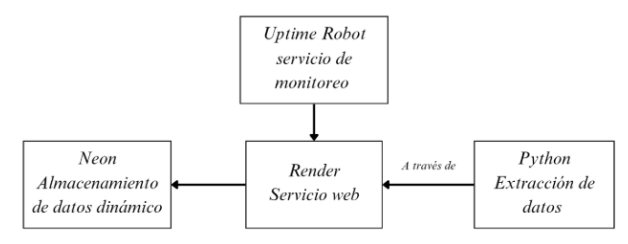

```{r}
#| echo: false
#| output: false
library(reticulate)
py_install(c("pandas", "praw", "python-dotenv"))
```

# Introducción
La persistencia de la desigualdad de género y la violencia contra las mujeres ha encontrado en el entorno digital un nuevo terreno fértil para su reproducción y amplificación. La misoginia online no es un fenómeno aislado, sino una manifestación sistemática de hostilidad que aprovecha las características de las plataformas sociales para perpetuar dinámicas de poder patriarcal. Espacios como Reddit, caracterizados por comunidades temáticas y un sistema de pseudonimato, permiten que estas interacciones discursivas se desenvuelvan y se amplifiquen, proporcionando un terreno único para observar cómo se construyen y disputan las identidades de género en la contemporaneidad (Scholz et al., 2025; Moloney & Love, 2018). Investigaciones previas han destacado cómo plataformas como Reddit han sido usadas por grupos radicales para difundir una retórica antifeminista y hostil hacia las mujeres (Fontanella et al., 2024; Sawicki & Solska, 2024). No obstante, los estudios sobre misoginia digital han tendido a concentrarse en estos grupos extremos, sin abordar completamente los discursos cotidianos que también permiten la manifestación de la misoginia en subreddits más generales como r/AskMen y r/AskWomen.

Este trabajo busca llenar esa brecha, al centrarse en los discursos de género presentes en estos espacios de interacción diaria y diferenciados por género, proponiendo que las emociones y el lenguaje son factores clave en la reproducción de la misoginia. A través del análisis de los comentarios en estos subreddits, se pretende explorar cómo se expresan las emociones negativas y cómo estos comentarios contribuyen a la perpetuación de actitudes misóginas. A través de este análisis, se busca no solo comprender las dinámicas lingüísticas y emocionales, sino también aportar al campo de investigación sobre la misoginia digital, ofreciendo una nueva perspectiva sobre cómo estos comportamientos operan en espacios cotidianos en línea. La pregunta central de esta investigación es: ¿Cómo se expresa la misoginia digital en comunidades digitales diferenciadas por género, específicamente en r/AskMen y r/AskWomen?

Para abordar esta cuestión, se comienza con una revisión bibliográfica de los conceptos teóricos fundamentales sobre la misoginia y su manifestación en Reddit, así como un repaso de investigaciones previas relevantes que contextualizan el fenómeno en entornos digitales. Posteriormente, se presentará un tutorial sobre la extracción y procesamiento de datos utilizando la API de Reddit, lo que permitirá recolectar una muestra significativa de publicaciones y comentarios. Seguido de esto, se procederá al análisis de los datos extraídos mediante modelos de procesamiento de lenguaje natural (NLP), como el “NLP-LTU/bertweet-large-sexism-detector” y “bhadresh-savani/distilbert-base-uncased-emotion” para identificar la presencia de comentarios misóginos y las emociones asociadas a estos. Por último, se realizarán pruebas estadísticas para comprobar las hipótesis formuladas.

# 2. Marco Conceptual y Antecedentes
## 2.1. La Misoginia como Mecanismo de Control Social
La expresión de estos comportamientos no ocurre en un vacío; está mediada por la tecnología. Rubio Martín y Gordo López (2021) presentan la perspectiva tecnosocial feminista, que sostiene que las plataformas digitales no son neutrales. Por el contrario, poseen características que pueden facilitar y amplificar la violencia de género. El diseño de foros como Reddit, que permite el anonimato y la formación de subcomunidades aisladas, favorece la creación de "realidades híbridas", en las que la distinción entre lo online y lo offline se desvanece. Este ambiente permite que las agresiones digitales, como el acoso coordinado o la difusión de imágenes íntimas, tengan efectos tangibles en la vida física y social de las mujeres. Así, la misoginia online no se entiende como un fenómeno aislado, sino como una adaptación tecnológica de la violencia estructural preexistente.

## 2.2. Misoginia Digital
La literatura ha documentado cómo Reddit se ha convertido en un espacio clave para la "Manosfera", un conjunto de comunidades unidas por una retórica antifeminista. Fontanella et al. (2024) destacan que la investigación sobre misoginia ha crecido desde 2010, en paralelo al auge de estos grupos, los cuales usan la plataforma para promover narrativas de victimización masculina y deshumanización de las mujeres. Sawicki y Solska (2024), al analizar el subreddit r/MensRights, encontraron que el discurso de este espacio ha evolucionado de una defensa de los derechos de los hombres hacia una hostilidad abierta contra el feminismo. Mediante el análisis de patrones lingüísticos, detectaron una retórica donde se culpa a las mujeres por los problemas sociales, lo que evidencia un sesgo de género arraigado en el lenguaje de la comunidad. Además, no solo los grupos radicales muestran estas dinámicas, Mulac et al. (2013) sugieren que tanto hombres como mujeres operan bajo esquemas de lenguaje vinculados al género, los cuales se activan inconscientemente en la comunicación. En el estudio de Aggarwal et al. (2020) sobre Reddit, se encontró que los hombres tienden a usar un lenguaje más cargado de emociones negativas y dominancia, especialmente al discutir temas de crisis, mientras que las mujeres priorizan temas más sociales y familiares. Estos hallazgos sugieren que las diferencias de género en el lenguaje se amplifican en contextos digitales, incluso en discusiones generales.

## 2.3 Las emociones detrás de la misoginia
Las emociones son fundamentales en la formación de la misoginia digital, ya que los comentarios que no solo expresan prejuicio, sino también ira, resentimiento o angustia, tienden a movilizarse con mayor intensidad en espacios online. En comunidades de hombres jóvenes que experimentan soledad o frustración, esta condición se transforma en hostilidad hacia las mujeres mediante un mecanismo de resentimiento (Tietjen & Tirkkonen, 2023). Además, los estudios sobre dinámicas emocionales en línea muestran que los contenidos con alta activación emocional aumentan tanto la participación como la deriva hacia discursos extremos (García et al., 2016). Esta interacción emocional también se refleja en los efectos psicológicos que sufren las mujeres al ser objetivo de acoso digital. Stevens et al. (2024) documentan que las mujeres suelen reportar efectos emocionales negativos, como enojo o tristeza, tras experiencias de acoso o misoginia online, lo que demuestra que la hostilidad digital tiene un impacto afectivo real. Sin embargo, los estudios de Dutta et al. (2024) revelan una falta de investigación que integre de manera sistemática la dimensión emocional del lenguaje misógino en plataformas de interacción digital. Por lo tanto, comprender cómo se manifiestan y distribuyen las emociones negativas en subreddits como r/AskMen y r/AskWomen contribuye a llenar una brecha significativa en el campo, ofreciendo nuevas perspectivas sobre cómo las emociones amplifican la misoginia en estos espacios.

Recientemente, se ha comenzado a investigar las diferencias de toxicidad entre comunidades de distinto género. Coppolillo (2025) realizó un análisis comparativo entre comunidades misóginas, como r/Incels y misándricas, como r/GenderCritical. Su estudio concluyó que, aunque ambos tipos de comunidades operan como cámaras de eco que refuerzan el odio, las comunidades misóginas presentan niveles de toxicidad textual significativamente más altos y picos de agresividad más pronunciados. Esto sugiere que, si bien la polarización es un fenómeno común en estos espacios, la violencia discursiva contra las mujeres es particularmente virulenta en la plataforma. A pesar de los estudios realizados en comunidades extremistas (Coppolillo, 2025; Sawicki & Solska, 2024; Fontanella et al., 2024), existe una laguna en la literatura en cuanto a cómo estos mecanismos de misoginia estructural y los sesgos lingüísticos operan en subreddits más generales y cotidianos diferenciados por el género, como lo son "r/AskMen" y "r/AskWomen". Este estudio busca llenar ese vacío, explorando cómo las dinámicas de género y las emociones detrás de la misoginia operan en estos espacios.

# 3. Pregunta, objetivo de investigación e hipótesis

A partir de la problemática y antecedentes expuestos, se plantea la siguiente pregunta de investigación: ¿Cómo se expresa la misoginia digital en comunidades digitales diferenciadas por género, específicamente en r/AskMen y r/AskWomen?

## Objetivos de investigación

**General**: Investigar de qué manera se expresa la misoginia digital en comunidades digitales diferenciadas por género, específicamente en r/AskMen y r/AskWomen. 

**Específicos**:

* Identificar la prevalencia de discursos misóginos en los comentarios publicados en los subReddits r/AskMen y r/AskWomen.

* Evaluar la relación entre las emociones y los discursos misóginos en los comentarios publicados en los subReddits r/AskMen y r/AskWomen.

* Evaluar la relación entre los discursos misóginos y las interacciones digitales que se dan en los subReddits r/AskMen y r/AskWomen.

## Hipótesis
**H1**: La proporción de comentarios misóginos es mayor en AskMen que en AskWomen.

**H2a**: Los usuarios que publican comentarios misóginos presentan una mayor actividad que quienes publican comentarios no misóginos.

**H2b**: Los comentarios misóginos reciben un menor puntaje de apoyo que los comentarios no misóginos.

**H3**: La proporción de comentarios con emociones negativas es mayor en AskMen que en AskWomen.

**H4**: Los comentarios que expresan emociones positivas tienen una menor probabilidad de ser clasificados como misóginos.

# 4. Fuente de información
La fuente de información donde se extrajeron los datos fue Reddit, específicamente los subreddits de r/AskMen y r/AskWomen.

AskMen fue creado el 30 de agosto de 2010. Es un espacio con alrededor de 2 millones de miembros y una participación activa de 41 mil contribuciones semanales. Su lema es “a place to discuss men’s experience”, demostrando ser un lugar para discutir y compartir vivencias desde la perspectiva masculina.

AskWomen, creado el 17 de julio de 2010, cuenta con más de 946 mil suscriptores y alrededor de 14 mil usuarios activos. Su propósito declarado es ofrecer un espacio donde las mujeres puedan responder con comodidad y sinceridad a preguntas sobre sus pensamientos, vidas y experiencias. Se enfatiza en el respeto y la ausencia de juicios, lo que lo convierte en un entorno distinto al de AskMen, con un enfoque más regulado hacia el tono y los temas de discusión.

Para la extracción de información de estos subreddits se utilizó la API de Reddit, mediante la librería PRAW. Esta herramienta permite automatizar la recolección de publicaciones y comentarios, asegurando un volumen considerable de datos y facilitando su análisis.


# 5. Tutorial

## 5.1. Extracción de de información

En primer lugar, con los tokens de la aplicación de la API de Reddit guardados y conectados correctamente. Luego, se procedió a la extracción de comentarios de Reddit, la cual fue posteriormente automatizada.

```{python}
#| eval: false

import praw
from datetime import datetime
import pandas as pd 
from dotenv import load_dotenv 
import os 
load_dotenv()
client_id = os.getenv('CLIENT_ID')
client_secret = os.getenv('CLIENT_SECRET')
username = os.getenv('USERNAME')
password = os.getenv('PASSWORD')
user_agent = os.getenv('USER_AGENT')
auth_url = "https://www.reddit.com/api/v1/access_token"
reddit = praw.Reddit(
    client_id=client_id,
    client_secret=client_secret,
    user_agent=user_agent
)
```

La extracción de datos se realizó a partir de los subreddits de r/AskMen y r/AskWomen. En primer lugar, se creó una variable que contiene ambos subreddits de los cuales se extrajeron los datos. Posteriormente, se creó un for anidado: el primero refiere a cada subReddit; el segundo, a las publicación, las cuales se filtraron las top por día, con un límite de 1000; el tercero, corresponde a los comentarios de cada publicación; para esto, se tuvo que añadir una línea de código para también extraer los códigos que están abajo del view more. Cabe mencionar, que el siguiente código es un fragmento que es parte del código de automatización de extracción de datos, por lo que este no funcionará por sí solo, pero se presentará por términos pedadógicos.

```{python}
#| eval: false
#| output: false
# Lista de subreddits a procesar
        subreddits = ["AskMen", "AskWomen"]
        total_comentarios = 0
       
        for subreddit_name in subreddits:
            logger.info(f"Procesando r/{subreddit_name}...")
            subreddit = reddit.subreddit(subreddit_name)
           
            for submission in subreddit.top(time_filter="day", limit=1000):
                submission.comments.replace_more(limit=None)
               
                for comment in submission.comments:
                    try:
                        # Preparar datos
                        datos = (
                            subreddit_name,
                            str(submission.author) if submission.author else '[deleted]',
                            submission.id,
                            submission.title,
                            submission.num_comments,
                            submission.over_18,
                            submission.score,
                            str(comment.author) if comment.author else '[deleted]',
                            comment.id,
                            comment.body,
                            comment.score,
                            datetime.fromtimestamp(comment.created_utc)
                        )

```

De esta forma, se recolectaron todos los comentarios de cada publicación del día en ambos subReddits. Además, la variable de tiempo se transformó de unix timestamp a datetime, lo que facilita su interpretación y análisis posterior. Finalmente, estos datos se insertaron en una base de datos dinámica online llamada Neon. 

```{python}
#| eval: false
#| output: false
# Insertar en la base de datos (ignora duplicados)
                        cursor.execute("""
                            INSERT INTO reddit_comments
                            (subreddit_nombre, submission_autor, submission_id, submission_titulo,
                             submission_numcom, submission_nsfw, submission_puntaje,
                             comentario_autor, comentario_id, comentario_body,
                             comentario_puntaje, comentario_fecha)
                            VALUES (%s, %s, %s, %s, %s, %s, %s, %s, %s, %s, %s, %s)
                            ON CONFLICT (comentario_id) DO NOTHING
                        """, datos)
                       
                        total_comentarios += 1
                       
                    except Exception as e:
                        logger.error(f"Error procesando comentario {comment.id}: {str(e)}")
                        continue

```

Este proceso de automatización emplea Python para la extracción diaria de datos de Reddit, ejecutándose a través de Render, una plataforma de servicio web. Los datos obtenidos se almacenan inmediatamente en una base de datos dinámica. Para garantizar la disponibilidad continua del servicio y prevenir caídas, se utiliza Uptime Robot como herramienta de monitoreo constante de la página web

{fig-align="center" width="80%"}

## 5.2 Procesamiento de la base de datos en R

### 5.2.1. Procesamiento de datos I

A partir de la base de datos brutos se generó una versión procesada con nombre datos_proc. En esta etapa se realizaron distintas transformaciones para mejorar la calidad de la información:

i)  Se eliminaron los comentarios repetidos.
ii) Se filtraron los comentarios con baja interacción, es decir, con puntajes de -1 a 1.
iii) Se generó una variable de número de comentarios publicados que reciben una interacción sustantiva por cada autor. 
iv) Se borraron comentarios eliminados.

```{r}
#| output: false
#| eval: false

#---- 2. Importar datos brutos ----
datos_bruto <- read_csv("data/datos_bruto.csv")


#---- 3. Procesamiento de datos brutos ----
datos_proc <- datos_bruto %>%
  distinct(comentario_id, .keep_all = TRUE)


datos_proc <- datos_proc %>%
  filter(comentario_puntaje < -1 | comentario_puntaje > 1)


datos_proc <- datos_proc %>%
  group_by(comentario_autor) %>%
  mutate(n_comentario_autor = n()) %>%
  ungroup()


datos_proc <- datos_proc %>%
  mutate(comentario_body = na_if(comentario_body, "[removed]"),
         comentario_body = na_if(comentario_body, "None"))


datos_proc <- na.omit(datos_proc)

```

### 5.2.2 Procesamiento de datos II: filtro por palabras clave

Luego, se realizó un filtro a partir de palabras claves relacionadas al género para mantener solo los comentarios que se discuten temas relacionados a las mujeres u hombres; este listado se obtuvo a partir de Coppolillo (2025). Además, se eliminaron los comentarios con menos de 4 palabras debido a la complejidad de analizar estos con herramientas de procesamiento de lenguaje natural. Por último, para mantener la proporción de la actividad inicial de cada subReddit, se ponderó la muestra en una relación 19:81, por lo tanto, la base de datos final quedó con 4455 casos, donde 846 son de r/AskWomen y 3609, de r/AskMen. 

```{r}
#| output: false
#| eval: false

#---- 4. Procesamiento de datos: solo género ----
palabras_genero <- c("relationship", "boy", "man", "men", "boyfriend", "husband",
              "partner", "girl", "woman", "women", "girlfriend", "wife", "ex")


palabras_genero <- paste0("\\b(", paste(palabras_genero, collapse = "|"), ")\\b")


datos_genero <- datos_proc %>%
  filter(str_detect(comentario_body, regex(palabras_genero, ignore_case = TRUE)) |
  (str_detect(submission_titulo, regex(palabras_genero, ignore_case = TRUE))))


datos_genero <- datos_genero %>%
  filter(str_count(comentario_body, "\\w+") >= 4)


#---- 5. Sampleo de bases de datos acorde a la actividad de cada subreddit ----
set.seed(123)


sample_askwomen <- datos_genero %>%
  filter(subreddit_nombre == "AskWomen") %>%
  slice_sample(n = 846)


sample_askmen <- datos_genero %>%
  filter(subreddit_nombre == "AskMen") %>%  
  slice_sample(n = 3609)


datos_genero <- bind_rows(sample_askwomen, sample_askmen)


write.csv(datos_genero, "datos_genero.csv")

```

### 5.2.3 Procesamiento de datos III: modelos de procesamiento de lenguaje natural (NLP)

**A. Modelo detector de sexismo**

A partir de la base de datos anterior, se proceso esta a partir de un modelo de clasificación de texto que detecta si existe sexismo o no en los comentarios. Para llevar a cabo esto, se realizó un batch processing, obteniendo así la presencia de misoginia y el porcentaje de confianza de esta estimación.

```{python}
#| output: false
#| eval: false

#---- 1. Modelo 1 ----
classifier = pipeline(
        "text-classification",
        model="NLP-LTU/bertweet-large-sexism-detector",
        device=-1,
        max_length=512
    )


datos_genero = pd.read_csv("datos_genero.csv")


# Configuración
batch_size = 32


# Preparar comentarios
datos_genero['comentario_body'] = datos_genero['comentario_body'].astype(str)
comentario_body = datos_genero['comentario_body'].tolist()


# Procesar en batches
resultados_comment = []
total_batches = (len(comentario_body) + batch_size - 1) // batch_size


inicio = time.time()


for i in range(0, len(comentario_body), batch_size):
    batch = comentario_body[i:i+batch_size]
    batch_results = classifier(batch,
    truncation=True)
    resultados_comment.extend(batch_results)
   
    if (i // batch_size) % 50 == 0 and i > 0:
        gc.collect()
   
    batch_num = (i // batch_size) + 1
    elapsed = time.time() - inicio
    est_total = (elapsed / batch_num) * total_batches
    est_restante = est_total - elapsed
   
    velocidad = (i + len(batch)) / elapsed
    print(f"Batch {batch_num}/{total_batches} | Procesados: {i+len(batch)}/{len(comentario_body)} | "
          f"Velocidad: {velocidad:.2f} coment/seg | Restante: {est_restante/60:.1f} min")


datos_genero['categoria_odio'] = [r['label'] for r in resultados_comment]
datos_genero['score_odio'] = [r['score'] for r in resultados_comment]

```

**B. Modelo clasificador de emociones**

Luego, se proceso a partir de otro modelo que clasifica los comentarios con respecto a las emociones que predominan en este. Se realizó el mismo proceso anterior, obteniendo así la emoción predominante con el porcentaje que refleja la cantidad de presencia de este atributo. La base de datos se guardó finalmente en datos_genero_final, la cual será la que se analizará posteriormente.

```{python}
#| output: false
#| eval: false

##---- 2. MODELO 2 -----
classifier = pipeline(
        "text-classification",
        model="bhadresh-savani/distilbert-base-uncased-emotion",
        return_all_scores=True,
        device=-1,
        max_length=512
    )


# Preparar comentarios
datos_genero['comentario_body'] = datos_genero['comentario_body'].astype(str)
comentario_body = datos_genero['comentario_body'].tolist()


# Procesar en batches
resultados_comment = []
total_batches = (len(comentario_body) + batch_size - 1) // batch_size


inicio = time.time()


for i in range(0, len(comentario_body), batch_size):
    batch = comentario_body[i:i+batch_size]
    batch_results = classifier(batch,
    truncation=True)
    resultados_comment.extend(batch_results)
   
    if (i // batch_size) % 50 == 0 and i > 0:
        gc.collect()
   
    batch_num = (i // batch_size) + 1
    elapsed = time.time() - inicio
    est_total = (elapsed / batch_num) * total_batches
    est_restante = est_total - elapsed
   
    velocidad = (i + len(batch)) / elapsed
    print(f"Batch {batch_num}/{total_batches} | Procesados: {i+len(batch)}/{len(comentario_body)} | "
          f"Velocidad: {velocidad:.2f} coment/seg | Restante: {est_restante/60:.1f} min")


datos_genero['emocion_principal'] = [max(r, key=lambda x: x['score'])['label'] for r in resultados_comment]
datos_genero['score_principal'] = [max(r, key=lambda x: x['score'])['score'] for r in resultados_comment]


datos_genero.to_csv("datos_ask_genero_final.csv", index=False, encoding='utf-8-sig')

```

Cabe mencionar que a partir de estas nuevas variables, se consideró que la clasificación de sexismo debe tener un porcentaje mayor al 95% de fiabilidad de predicción y las emociones un 50% para ser consideradas predominantes. Además, se creó una variable dicotómica que agrupaba las emociones positivas (“joy”, “love” y “surprise”) y las negativas ("sadness", "anger" y "fear").

```{r}
#| output: false
#| eval: false

datos_genero_final <- datos_genero_final %>%
  mutate(categoria_odio = case_when(
    categoria_odio == "not sexist" ~ 0,
    categoria_odio == "sexist" ~ 1))


datos_genero_final <- datos_genero_final %>%
  mutate(categoria_odio = case_when(
    score_odio >= 0.95 ~ categoria_odio,
    score_odio < 0.95 ~ NA))


datos_genero_final <- datos_genero_final %>%
  mutate(emocion_principal = case_when(
    score_principal >= 0.5 ~ emocion_principal,
    score_principal < 0.5 ~ NA)) %>%
  mutate(emocion_predominante = case_when(
    emocion_principal %in% c("sadness", "anger", "fear") ~ 0,
    emocion_principal %in% c("joy","love","surprise") ~ 1))

```

# 6. Análisis

## 6.1 Descriptivos
```{r}
#| output: false
#| echo: false
library(dplyr)
library(readr)
library(tidyr)
library(ggplot2)
library(stringr)
library(gt)
library(scales)
library(lubridate)
library(tidyverse)

     
options(scipen = 999)

# Cargar BBDD total
datos_proc_tot <- read_csv("data/datos_proc_tot.csv")


#Cargar BBDD procesada
datos_genero_final <- read_csv("data/datos_genero_final.csv")


```


```{r}
#| echo: false
#| output: false
#| label: chunk_descriptivos
 
# Tabla 1: Variables

variables_info <- tibble::tribble(
  ~Variable, ~Definición,
  "subreddit_nombre", "Nombre del subreddit de donde proviene la publicación (AskMen o AskWomen).",
  "submission_autor", "Usuario que creó la publicación original.",
  "submission_id", "Identificador único de la publicación en Reddit.",
  "submission_titulo", "Título de la publicación realizada en el subreddit.",
  "submission_numcom", "Número total de comentarios que recibió la publicación.",
  "submission_NSFW", "Indica si la publicación fue marcada como NSFW (Not Safe For Work) (0 = no, 1 = sí).",
  "submission_puntaje", "Puntaje total de la publicación (upvotes – downvotes).",
  "comentario_autor", "Usuario que escribió el comentario.",
  "comentario_id", "Identificador único de cada comentario en Reddit.",
  "comentario_body", "Texto completo del comentario.",
  "comentario_puntaje", "Puntaje del comentario (upvotes – downvotes).",
  "comentario_fecha", "Fecha en que se realizó el comentario (formato día-mes-año).",
  "comentario_hora", "Hora en que se realizó el comentario.",
  "n_comentario_autor", "Número total de comentarios sustantivos por cada usuario.",
  "categoria_odio", "Variable binaria generada por el modelo de sexismo (1 = sexista, 0 = no sexista, NA = baja confianza).",
  "score_odio", "Probabilidad asignada por el modelo de que el comentario sea sexista.",
  "emocion_principal", "Emoción predominante detectada en el comentario (anger, fear, sadness, joy, love, surprise).",
  "score_principal", "Probabilidad asociada a la emoción principal seleccionada.",
  "emocion_predominante", "Variable binaria que clasifica emociones negativas (0) y positivas (1)."
)


 tabla_1_variables <- variables_info %>%
  gt() %>%
  tab_header(
    title = md("**Tabla 1: Variables incluidas en el análisis: Definición de cada variable del dataset procesado**"),
    subtitle = "Definición de cada variable"
  ) %>%
  cols_label(
    Variable = "Variable",
    Definición = "Definición"
  ) %>%
  tab_options(
    table.font.size = px(13),
    row.striping.include_table_body = TRUE,
    table.width = pct(100),
    table.align = "center"
  )


# Tabla 2: Descriptivos Muestra final
resumen_final <- datos_genero_final %>%
  group_by(subreddit_nombre) %>%
  summarise(
    total_comentarios   = n(),
    total_autores       = n_distinct(comentario_autor),
    prop_muestra        = total_comentarios / nrow(datos_genero_final),
    prop_sexistas       = mean(categoria_odio == 1, na.rm = TRUE),
    prop_emociones_neg  = mean(emocion_predominante == 0, na.rm = TRUE),
    .groups = "drop"
  )

tabla_2_descriptivos <- resumen_final %>%
  gt() %>%
  tab_header(
    title = "Tabla 2: Características descriptivas de la muestra final",
    subtitle = "Distribución de comentarios, autores, sexismo y emociones por subreddit"
  ) %>%
  cols_label(
    subreddit_nombre   = "Subreddit",
    total_comentarios  = "Total comentarios",
    total_autores      = "Autores únicos",
    prop_muestra       = "% de la muestra",
    prop_sexistas      = "% sexistas",
    prop_emociones_neg = "% emociones negativas"
  ) %>%
  fmt_number(
    columns = c(total_comentarios, total_autores),
    decimals = 0,
    use_seps = TRUE
  ) %>%
  fmt_percent(
    columns = c(prop_muestra, prop_sexistas, prop_emociones_neg),
    decimals = 1
  ) %>%
  tab_options(
    table.width = pct(100),
    table.align = "center"
  )

# Gráfico 1: Actividad de comentarios por semana cada subreddit

datos_ask_subreddit <- datos_proc_tot %>%
  group_by(comentario_fecha, subreddit_nombre) %>%
  summarise(
    submission_cantidad = n(),
    submission_puntaje = mean(submission_puntaje),
    submission_NSFW = sum(submission_NSFW)
  ) %>%
  ungroup() %>%
  mutate(comentario_fecha = as.Date(comentario_fecha)) %>%
  arrange(comentario_fecha, subreddit_nombre)

datos_ask_semana <- datos_ask_subreddit %>%
  mutate(semana = floor_date(comentario_fecha, "week")) %>%
  group_by(subreddit_nombre, semana) %>%
  summarise(submission_cantidad = sum(submission_cantidad),
            .groups = "drop")

graf_semana <- ggplot(datos_ask_semana,
                aes(x = semana, y = submission_cantidad,
                    color = subreddit_nombre)) +
  geom_line(size = 1) +
  geom_point(size = 2) +
  labs(
    title = "Figura 1: Actividad semanal de comentarios por subreddits",
    subtitle = "Comparación entre r/AskMen y r/AskWomen",
    x = "Semana",
    y = "Cantidad de comentarios",
    color = "Subreddit"
  ) +
  theme_minimal() +
  theme(axis.text.x = element_text(angle = 45, hjust = 1)) +
  scale_color_manual(values = c("AskMen" = "#1f77b4",
                                "AskWomen" = "#d62728"))


```

La @tbl-1 presenta las variables incluidas en el análisis, que combinan información de la publicación original, de cada comentario y de los modelos de clasificación. Se distinguen variables de contexto del subreddit y de la publicación (nombre del subreddit, autor, puntaje, número de comentarios), variables propias de cada comentario (texto, autor, fecha, hora, puntaje y número total de comentarios realizados por ese usuario) y variables generadas por los modelos de NLP, que identifican la probabilidad de sexismo y la emoción predominante en cada comentario, así como una clasificación binaria de misoginia y de emociones negativas o positivas.

```{r}
#| echo: false
#| label: tbl-1

 tabla_1_variables
```

<br> La @fig-1 resume la actividad semanal de comentarios en la base inicial de 118003 observaciones. En todo el periodo analizado, r/AskMen concentra consistentemente un volumen de comentarios muy superior al de r/AskWomen, con varios picos de actividad que duplican o triplican la cantidad de comentarios semanales observados en el subreddit femenino. En ambos casos la actividad muestra variaciones a lo largo de las semanas, pero sin que en ningún momento r/AskWomen alcance niveles comparables a los de r/AskMen.

```{r}
#| echo: false
#| label: fig-1
graf_semana
```

<br> La @tbl-2 presenta los estadísticos descriptivos de la cantidad de comentarios diarios. El promedio de AskMen (1833) es más de cuatro veces superior al de AskWomen (438). Esto implica que, en promedio, por cada comentario en AskWomen, se registran cuatro en AskMen. Además, la variabilidad es mayor en AskMen, con un rango que llega hasta más de 2000 comentarios, lo que indica mayor heterogeneidad en la actividad de este subreddit.

```{r}
#| echo: false
#| label: tbl-2
tabla_2_descriptivos
```

<br>

## Análisis de H1

```{r}
#| echo: false
#| label: chunk_H1

# H1: Tabla----------

# 1. Crear las variables necesarias para H1 

# Total de comentarios por subreddit
n_total_askmen    <- datos_genero_final %>% filter(subreddit_nombre == "AskMen") %>% nrow()
n_total_askwomen  <- datos_genero_final %>% filter(subreddit_nombre == "AskWomen") %>% nrow()

# Total de comentarios sexistas por subreddit
n_sexistas_askmen <- datos_genero_final %>% 
  filter(subreddit_nombre == "AskMen", categoria_odio == 1) %>% 
  nrow()

n_sexistas_askwomen <- datos_genero_final %>% 
  filter(subreddit_nombre == "AskWomen", categoria_odio == 1) %>% 
  nrow()

# Proporciones
prop_askmen   <- n_sexistas_askmen   / n_total_askmen
prop_askwomen <- n_sexistas_askwomen / n_total_askwomen

# 2. Test estadístico H1
h1_test <- prop.test(
  x = c(n_sexistas_askmen, n_sexistas_askwomen),
  n = c(n_total_askmen,   n_total_askwomen),
  alternative = "greater",
  correct = TRUE
)

# 3. Armar tabla tibble 
h1_tabla_test <- tibble(
  Method        = "2-sample test for equality of proportions\nwith continuity correction",
  Hipótesis     = h1_test$alternative,
  Prop_AskMen   = prop_askmen,
  Prop_AskWomen = prop_askwomen,
  Diff_M1_M2    = prop_askmen - prop_askwomen,
  Chi2          = unname(h1_test$statistic),
  df            = unname(h1_test$parameter),
  p             = h1_test$p.value,
  CI_low        = h1_test$conf.int[1],
  CI_high       = h1_test$conf.int[2]
) %>%
  mutate(
    p = pvalue_format()(p)
  )

# 4. Convertir a tabla GT
h1_tabla_test_gt <- h1_tabla_test %>%
  gt() %>%
  tab_header(
    title = "Tabla 3: Test de diferencia de proporciones para comentarios sexistas (H1)"
  ) %>%
  cols_label(
    Method        = "Método",
    Hipótesis     = "Hipótesis",
    Prop_AskMen   = "Prop. AskMen",
    Prop_AskWomen = "Prop. AskWomen",
    Diff_M1_M2    = "M₁ - M₂",
    Chi2          = html("Chi²"),
    df            = "df",
    p             = "p",
    CI_low        = "95% CI (inf)",
    CI_high       = "95% CI (sup)"
  ) %>%
  fmt_number(
    columns = c(Prop_AskMen, Prop_AskWomen, Diff_M1_M2, Chi2, CI_low, CI_high),
    decimals = 4
  ) %>%
  tab_options(
    table.width = pct(100),
    column_labels.font.weight = "normal"
  )


# H1: Figura----------

# 1. Datos preparados
datos_h1 <- datos_genero_final %>%
  filter(!is.na(categoria_odio),
         subreddit_nombre %in% c("AskMen", "AskWomen")) %>%
  mutate(
    subreddit_nombre = factor(subreddit_nombre,
                              levels = c("AskMen", "AskWomen")),
    categoria_odio = as.numeric(categoria_odio)
  )

# 2. Proporciones + IC 
h1_resumen <- datos_h1 %>%
  group_by(subreddit_nombre) %>%
  summarise(
    n_total = n(),
    n_sexistas = sum(categoria_odio == 1),
    prop = n_sexistas / n_total,
    se = sqrt(prop * (1 - prop) / n_total),
    ic_inf = prop - 1.96 * se,
    ic_sup = prop + 1.96 * se,
    .groups = "drop"
  )

# 3. Gráfico 
graf_h1 <- ggplot(h1_resumen, aes(x = subreddit_nombre, y = prop)) +
  geom_col(
    aes(fill = subreddit_nombre),
    width = 0.55,
    color = "grey30",
    alpha = 0.9
  ) +
  geom_errorbar(
    aes(ymin = ic_inf, ymax = ic_sup),
    width = 0.15,
    size = 1.2,
    color = "grey20"
  ) +
  scale_fill_manual(values = c("AskMen" = "#F6D186",   
                               "AskWomen" = "#F8AFA6")) + 
  scale_y_continuous(labels = scales::percent_format(accuracy = 0.1)) +
  labs(
    title = " Figura 2: Proporción de comentarios sexistas por subreddit (H1)",
    subtitle = "Media y IC 95% de la proporción de comentarios sexistas por subreddit",
    x = "Subreddit",
    y = "Proporción de comentarios sexistas"
  ) +
  theme_minimal(base_size = 14) +
  theme(
    legend.position = "none",
    panel.grid.major.x = element_blank(),
    axis.text.x = element_text(size = 12)
  )
```

La @tbl-3 muestra que la diferencia de proporciones de comentarios sexistas es mayor en r/AskMen que en r/AskWomen. Los resultados indican que r/AskMen presenta un 3.35 % de comentarios sexistas, mientras que r/AskWomen registra solo un 0.12 %. La diferencia entre ambas proporciones es estadísticamente significativa (p < .001). La @fig-2 complementa este resultado al mostrar que la proporción de comentarios sexistas en r/AskMen es considerablemente más alta y su intervalo de confianza no se solapa con el de r/AskWomen.

<br>

```{r}
#| echo: false
#| label: tbl-3
h1_tabla_test_gt
```

<br>

```{r}
#| echo: false
#| label: fig-2
graf_h1 
```

<br>

## Análsis de H2A

```{r}
#| echo: false
#| label: chunk_H2a

# H2a: Tabla----------

# t-test H2a 
h2a_tt <- t.test(n_comentario_autor ~ categoria_odio, data = datos_genero_final, alternative = "less")

# Tabla con los resultados 
h2a_tabla_ttest <- tibble(
  Method      = h2a_tt$method,
  Alternative = h2a_tt$alternative,
  Mean_0      = h2a_tt$estimate[[1]],
  Mean_1      = h2a_tt$estimate[[2]],
  Diff        = Mean_0 - Mean_1,
  t           = h2a_tt$statistic,
  df          = h2a_tt$parameter,
  p           = h2a_tt$p.value,
  CI          = paste0("[",
                       sprintf("%.2f", h2a_tt$conf.int[1]), ", ",
                       sprintf("%.2f", h2a_tt$conf.int[2]), "]")
)

# Tabla formateada en gt 
h2a_tabla_ttest_gt <- h2a_tabla_ttest %>%
  gt() %>%
  tab_header(
    title = "Tabla 4: Diferencia de medias en la actividad según tipo de comentario (H2a)",
    subtitle = "Comparación de la actividad entre comentarios sexistas y no sexistas"
  ) %>%
  fmt_number(columns = c(Mean_0, Mean_1, Diff, t, df), decimals = 2) %>%
  fmt_number(columns = p, decimals = 4) %>%
  cols_label(
    Alternative = "Alternative",
    Mean_0      = "Mean (No sexista)",
    Mean_1      = "Mean (Sexista)",
    Diff        = "M₀ − M₁",
    t           = "t",
    df          = "df",
    p           = "p",
    CI          = "95% CI"
  ) %>%
  tab_options(
    table.width = pct(90),
    table.align = "center"
  )


  # H2a: Figura----------

# 1. Datos H2A 
datos_plot_h2a <- datos_genero_final %>%
  filter(!is.na(categoria_odio),
         !is.na(n_comentario_autor)) %>%
  mutate(
    categoria_odio = factor(
      categoria_odio,
      levels = c(0, 1),
      labels = c("No sexista", "Sexista")
    )
  )

# 2. Resumen 
resumen_h2a <- datos_plot_h2a %>%
  group_by(categoria_odio) %>%
  summarise(
    n      = n(),
    media  = mean(n_comentario_autor),
    se     = sd(n_comentario_autor) / sqrt(n),
    tcrit  = qt(0.975, df = n - 1),
    ic_inf = media - tcrit * se,
    ic_sup = media + tcrit * se,
    .groups = "drop"
  )

# 3. Muestra de puntos
set.seed(123)
datos_visual_sample_h2a <- datos_plot_h2a %>%
  group_by(categoria_odio) %>%
  slice_sample(n = 150, replace = FALSE) %>%
  ungroup()

# 4. Ajuste eje Y 
lim_sup_h2a <- 30

# 5. Gráfico final H2A 
graf_h2a <- ggplot() +
  geom_col(
    data = resumen_h2a,
    aes(x = categoria_odio, y = media, fill = categoria_odio),
    width = 0.5,
    color = "grey30",
    alpha = 0.9
  ) +
  geom_point(
    data = datos_visual_sample_h2a,
    aes(x = categoria_odio, y = n_comentario_autor, color = categoria_odio),
    position = position_jitter(width = 0.09, height = 0),
    alpha = 0.45,
    size  = 2
  ) +
  geom_errorbar(
    data = resumen_h2a,
    aes(x = categoria_odio, ymin = ic_inf, ymax = ic_sup),
    width = 0.15, size = 1.1
  ) +
  scale_fill_manual(values = c(
    "No sexista" = "#C4A7E7",
    "Sexista"    = "#8DBCEB"
  )) +
  scale_color_manual(values = c(
    "No sexista" = "#7F3FBF", 
    "Sexista"    = "#2A66A3"
  )) +
  labs(
    title    = "Figura 3: Actividad promedio según presencia de sexismo (H2a)",
    subtitle = "Media, IC 95% y distribución de la actividad por tipo de comentario",
    x = "Tipo de comentario",
    y = "Actividad del usuario (n° de comentarios)"
  ) +
  coord_cartesian(ylim = c(0, lim_sup_h2a)) +
  theme_minimal(base_size = 13) +
  theme(
    legend.position    = "none",
    plot.title         = element_text(size = 16, lineheight = 1.1),
    panel.grid.major.x = element_blank(),
    panel.grid.minor   = element_blank(),
    axis.text.x        = element_text(size = 11)
  )

```

La @tbl-4 presenta el test de diferencia de medias para comparar la actividad de los usuarios que publican comentarios sexistas respecto de quienes publican comentarios no sexistas. La media de actividad es mayor en el grupo que publica contenido sexista, con 14.43 comentarios en promedio, frente a 10.90 en quienes no publican contenido sexista. La diferencia entre ambas medias es estadísticamente significativa (p = .017). La @fig-3 muestra esta brecha con claridad, evidenciando además la dispersión de la actividad por usuario. Estos resultados indican que los autores de comentarios sexistas tienden a mostrar un nivel de actividad más alto dentro de la plataforma.

<br> 

```{r}
#| echo: false
#| label: tbl-4

h2a_tabla_ttest_gt
```

<br>

```{r}
#| echo: false
#| label: fig-3

graf_h2a
```

<br>

## Análisis de H2B

```{r}
#| echo: false
#| label: chukn_H2b

# 1. H2b: Tabla------

# t-test H2b 
h2b_tt <- t.test(comentario_puntaje ~ categoria_odio, data = datos_genero_final, alternative = "greater")

# Tabla con los resultados 
h2b_tabla_ttest <- tibble(
  Method      = h2b_tt$method,
  Alternative = h2b_tt$alternative,
  Mean_0      = h2b_tt$estimate[[1]],
  Mean_1      = h2b_tt$estimate[[2]],
  Diff        = Mean_0 - Mean_1,
  t           = h2b_tt$statistic,
  df          = h2b_tt$parameter,
  p           = h2b_tt$p.value,
  CI          = paste0("[",
                       sprintf("%.2f", h2b_tt$conf.int[1]), ", ",
                       sprintf("%.2f", h2b_tt$conf.int[2]), "]")
)

# Tabla formateada en gt
h2b_tabla_ttest_gt <- h2b_tabla_ttest %>%
  gt() %>%
  tab_header(
    title = "Tabla 5: Diferencia de medias en el puntaje de comentarios según presencia de sexismo (H2b)",
    subtitle = "Comparación del puntaje entre comentarios sexistas y no sexistas"
  ) %>%
  fmt_number(columns = c(Mean_0, Mean_1, Diff, t, df), decimals = 2) %>%
  fmt_number(columns = p, decimals = 4) %>%
  cols_label(
    Alternative = "Alternative",
    Mean_0      = "Mean (No sexista)",
    Mean_1      = "Mean (Sexista)",
    Diff        = "M₀ − M₁",
    t           = "t",
    df          = "df",
    p           = "p",
    CI          = "95% CI"
  ) %>%
  tab_options(
    table.width = pct(90),
    table.align = "center"
  )

# 3. H2b: Figura ------

# 1. Datos completos procesados 
datos_plot_h2b <- datos_genero_final %>%
  filter(!is.na(categoria_odio),
         !is.na(comentario_puntaje)) %>%
  mutate(
    categoria_odio = factor(
      categoria_odio,
      levels = c(0, 1),
      labels = c("No sexista", "Sexista")
    )
  )

# 2. Resumen 
resumen_h2b <- datos_plot_h2b %>%
  group_by(categoria_odio) %>%
  summarise(
    n      = n(),
    media  = mean(comentario_puntaje),
    se     = sd(comentario_puntaje) / sqrt(n),
    tcrit  = qt(0.975, df = n - 1),
    ic_inf = media - tcrit * se,
    ic_sup = media + tcrit * se,
    .groups = "drop"
  )

# 3. Puntos visibles

lim_inf_points_h2b <- -10 
lim_sup_points_h2b <- 40

datos_visual_h2b <- datos_plot_h2b %>%
  filter(comentario_puntaje >= lim_inf_points_h2b,
         comentario_puntaje <= lim_sup_points_h2b)


set.seed(123)
datos_visual_sample_h2b <- datos_visual_h2b %>%
  group_by(categoria_odio) %>%
  slice_sample(n = 150, replace = FALSE) %>%
  ungroup()

# 4. Gráfico final 
graf_h2b <- ggplot() +
  geom_col(
    data = resumen_h2b,
    aes(x = categoria_odio, y = media, fill = categoria_odio),
    width = 0.5,
    color = "grey30",
    alpha = 0.9
  ) +
  geom_point(
    data = datos_visual_sample_h2b,
    aes(x = categoria_odio, y = comentario_puntaje, color = categoria_odio),
    position = position_jitter(width = 0.09, height = 0),
    alpha = 0.45,
    size  = 2
  ) +
  geom_errorbar(
    data = resumen_h2b,
    aes(x = categoria_odio, ymin = ic_inf, ymax = ic_sup),
    width = 0.15, size = 1.1
  ) +
  scale_fill_manual(values = c("No sexista" = "#A5D6A7",
                               "Sexista"   = "#EF9A9A")) +
  scale_color_manual(values = c("No sexista" = "#2E7D32",
                                "Sexista"   = "#C62828")) +
  labs(
    title    = "Figura 4: Puntaje promedio según presencia de sexismo (H2b)",
    subtitle = "Media, IC 95% y distribución del puntaje por tipo de comentario",
    x = "Tipo de comentario",
    y = "Puntaje del comentario (upvotes – downvotes)"
  ) +
  coord_cartesian(ylim = c(lim_inf_points_h2b, lim_sup_points_h2b)) +
  theme_minimal(base_size = 13) +
  theme(
    legend.position    = "none",
    panel.grid.major.x = element_blank(),
    panel.grid.minor   = element_blank(),
    axis.text.x        = element_text(size = 11)
  )


```

La @tbl-5 presenta el test de diferencia de medias para comparar el puntaje obtenido por los comentarios sexistas y no sexistas. Los comentarios no sexistas muestran un puntaje promedio de 28.93, mientras que los comentarios sexistas obtienen en promedio 16.48. La diferencia es estadísticamente significativa (p = .004). La @fig-4 muestra que los comentarios sexistas reciben, en general, menos apoyo (upvotes - downvotes) que los no sexistas, y sus intervalos de confianza reflejan esta tendencia. Estos resultados sugieren que los comentarios sexistas tienden a ser menos valorados por la comunidad que los comentarios sin contenido sexista.

<br>

```{r}
#| echo: false
#| label: tbl-5

h2b_tabla_ttest_gt
```

<br>

```{r}
#| echo: false
#| label: fig-4

graf_h2b
```

<br>

## Análisis de H3
```{r}
#| echo: false
#| label: chunk-H3


# H3: Tabla ----


# 1. Datos preparados
datos_h3 <- datos_genero_final %>%
  filter(
    !is.na(emocion_predominante),
    !is.na(subreddit_nombre)
  )

# Conteos de emociones negativas por subreddit
n_negativos_askmen <- sum(datos_h3$emocion_predominante == 0 &
                          datos_h3$subreddit_nombre == "AskMen")

n_total_askmen <- sum(datos_h3$subreddit_nombre == "AskMen")

n_negativos_askwomen <- sum(datos_h3$emocion_predominante == 0 &
                            datos_h3$subreddit_nombre == "AskWomen")

n_total_askwomen <- sum(datos_h3$subreddit_nombre == "AskWomen")

# Test proporcional
h3_test <- prop.test(
  x = c(n_negativos_askmen, n_negativos_askwomen),
  n = c(n_total_askmen, n_total_askwomen),
  alternative = "greater"  # H3: AskMen > AskWomen
)

# Tabla resumen
h3_tabla_test <- tibble(
  Método           = h3_test$method,
  Hipótesis        = h3_test$alternative,
  `Prop. AskMen`   = round(h3_test$estimate[1], 4),
  `Prop. AskWomen` = round(h3_test$estimate[2], 4),
  `M₁ - M₂`        = round(h3_test$estimate[1] - h3_test$estimate[2], 4),
  Chi2             = round(as.numeric(h3_test$statistic), 3),
  df               = as.numeric(h3_test$parameter),
  p                = format.pval(h3_test$p.value, digits = 3, eps = 0.001),
  `95% CI (inf)`   = round(h3_test$conf.int[1], 4),
  `95% CI (sup)`   = round(h3_test$conf.int[2], 4)
)

h3_tabla_test_gt <- h3_tabla_test %>%
  gt() %>%
  tab_header(
    title = md("Tabla 6: Test de diferencia de proporciones para emociones negativas entre subreddits (H3"),
    subtitle = "Resultados del test de diferencia de proporciones"
  ) %>%
  cols_align("center")


# H3: Figura ------

# Resumen para gráfico
resumen_h3 <- tibble(
  subreddit = c("AskMen", "AskWomen"),
  negativos = c(n_negativos_askmen, n_negativos_askwomen),
  total     = c(n_total_askmen, n_total_askwomen)
) %>%
  mutate(
    prop = negativos / total,
    se = sqrt(prop * (1 - prop) / total),
    z = qnorm(0.975),
    ic_inf = prop - z * se,
    ic_sup = prop + z * se
  )

# Colores 
colores_h3 <- c("AskMen" = "#FFB74D", 
                "AskWomen" = "#4FC3F7") 

graf_h3 <- ggplot(resumen_h3,
                  aes(x = subreddit, y = prop, fill = subreddit)) +
  geom_col(width = 0.55, color = "grey40", alpha = 0.9) +
  geom_errorbar(aes(ymin = ic_inf, ymax = ic_sup),
                width = 0.12, size = 1.1, color = "grey20") +
  scale_fill_manual(values = colores_h3) +
  scale_y_continuous(labels = scales::percent_format(accuracy = 0.1)) +
  labs(
    title = "Figura 5: Proporción de emociones negativas por subreddit (H3)",
    subtitle = "Media y IC 95% de la proporción de emociones negativas por subreddit",
    x = "Subreddit",
    y = "Proporción de emociones negativas"
  ) +
  theme_minimal(base_size = 13) +
  theme(
    legend.position    = "none",
    panel.grid.major.x = element_blank(),
    panel.grid.minor   = element_blank()
  )


```

La @tbl-6 presenta el test de diferencia de proporciones para evaluar si la proporción de comentarios con emociones negativas es mayor en r/AskMen que en r/AskWomen. Los resultados muestran que r/AskMen presenta un 46.83 % de comentarios clasificados como negativos, mientras que r/AskWomen alcanza un 40.58 %. La diferencia entre ambas proporciones es estadísticamente significativa (p < .001). La @fig-5 respalda esta evidencia al mostrar intervalos de confianza más altos para r/AskMen. En conjunto, estos resultados indican que r/AskMen concentra una mayor proporción de comentarios con emociones negativas, lo que entrega sustento a favor de la hipótesis H3.

<br>

```{r}
#| echo: false
#| label: tbl-6
h3_tabla_test_gt
```

<br>

```{r}
#| echo: false
#| label: fig-5
graf_h3
```

<br>

## Análisis de H4

```{r}
#| echo: false
#| output: false
#| label: chunk-H4

# H4: Tabla

# RLG

modelo_logit <- glm(
  categoria_odio ~ emocion_predominante,
  data = datos_genero_final,
  family = binomial(link = "logit")
)

exp(coef(modelo_logit))

summary(modelo_logit)
exp(coef(modelo_logit))


# 1. Extraer coeficientes del modelo 
summary_h4 <- summary(modelo_logit)

coefs <- summary_h4$coefficients
b    <- coefs[, 1]   # Estimates (log-odds)
se   <- coefs[, 2]   # Std. Error
z    <- coefs[, 3]   # z value
praw <- coefs[, 4]   # p-value bruto

# Intervalos de confianza 95% en OR
ci_logit <- confint(modelo_logit)           # en log-odds
ci_or    <- exp(ci_logit)                   # en OR

# 2. Construir tabla 
tabla_h4 <- tibble(
  Predictor = c("Emoción positiva (1)", "Constante"),
  B         = c(b["emocion_predominante"], b["(Intercept)"]),
  SE        = c(se["emocion_predominante"], se["(Intercept)"]),
  Wald      = (B / SE)^2,                     # z^2
  gl        = 1L,
  p_raw     = c(praw["emocion_predominante"], praw["(Intercept)"]),
  OR        = exp(B),
  CI_inf    = c(ci_or["emocion_predominante", 1],
                ci_or["(Intercept)", 1]),
  CI_sup    = c(ci_or["emocion_predominante", 2],
                ci_or["(Intercept)", 2])
) %>%

  mutate(
    p = ifelse(p_raw < 0.001, "< 0.001",
               sprintf("%.3f", p_raw))
  ) %>%
  select(Predictor, B, SE, Wald, gl, p, OR, CI_inf, CI_sup)

# 3. Pasar a gt
h4_tabla_gt <- tabla_h4 %>%
  gt() %>%
  tab_header(
    title    = "Tabla 7: Modelo logit de probabilidad de comentario misógino según tipo de emoción (H4)",
    subtitle = "Probabilidad de comentario sexista según emoción positiva"
  ) %>%
  cols_label(
    Predictor = "Predictor",
    B         = "B (log-odds)",
    SE        = "SE",
    Wald      = "Wald",
    gl        = "gl",
    p         = "p",
    OR        = "OR",
    CI_inf    = "95% CI (inf)",
    CI_sup    = "95% CI (sup)"
  ) %>%
  fmt_number(
    columns = c(B, SE, Wald, OR, CI_inf, CI_sup),
    decimals = 3
  ) %>%
  tab_options(
    table.width = pct(100),
    table.align = "center"
  )


  # H4: Figura -----

# 1. Crear dataset
newdata_h4 <- tibble(
  emocion_predominante = c(0, 1)  # 0 = negativa, 1 = positiva
)

# 2. Obtener predicciones con IC95%
pred_h4 <- predict(
  modelo_logit,
  newdata = newdata_h4,
  type = "link",
  se.fit = TRUE
)

# 3. Convertir a escala de probabilidad
newdata_h4 <- newdata_h4 %>% 
  mutate(
    fit     = plogis(pred_h4$fit),                
    ic_inf  = plogis(pred_h4$fit - 1.96*pred_h4$se.fit),
    ic_sup  = plogis(pred_h4$fit + 1.96*pred_h4$se.fit),
    emocion = factor(emocion_predominante,
                     levels = c(0,1),
                     labels = c("Emoción negativa", "Emoción positiva"))
  )

# 4. Gráfico
graf_h4_pred <- ggplot(newdata_h4, aes(x = emocion, y = fit)) +
  geom_point(size = 4, color = "#2A6F97") +
  geom_errorbar(aes(ymin = ic_inf, ymax = ic_sup),
                width = 0.15, size = 1, color = "#2A6F97") +
  scale_y_continuous(labels = scales::percent_format(accuracy = 0.1)) +
  labs(
    title = "Figura 6: Probabilidad predicha de misoginia según emoción (H4)",
    subtitle = "Estimaciones del modelo logit con intervalos de confianza del 95%",
    x = "Tipo de emoción predominante",
    y = "Probabilidad de misoginia predicha"
  ) +
  theme_minimal(base_size = 14) +
  theme(
    axis.text.x  = element_text(size = 11),
    axis.text.y  = element_text(size = 11),
    plot.title   = element_text(size = 14, face = "bold", lineheight = 1.1),
    plot.title.position = "plot",
    plot.subtitle= element_text(size = 12),
    plot.margin = margin(t = 20, r = 10, b = 10, l = 10)
  )

```

La @tbl-7 presenta los resultados del modelo logit que examina si las emociones positivas disminuyen la probabilidad de que un comentario sea clasificado como misógino. El coeficiente asociado a la emoción positiva es negativo y significativo (B = −0.530, p = .006), lo que señala que los comentarios con emociones positivas presentan menores log-odds de ser misóginos en comparación con aquellos que expresan emociones negativas. El odds ratio correspondiente (OR = 0.589) indica que los comentarios con emociones positivas tienen aproximadamente un 41% menos de probabilidades de ser catalogados como sexistas. La @fig-6 muestra esta diferencia en términos sustantivos, ya que la probabilidad predicha de misoginia es más baja cuando el comentario expresa una emoción positiva. Sin embargo, la capacidad explicativa del modelo resulta limitada, especialmente en espacios con baja prevalencia de misoginia. En conjunto, estos resultados entregan evidencia a favor de la hipótesis H4 sobre que la dimensión emocional tiene una asociación en la variación de la probabilidad de incurrir en lenguaje misogino, pero esta se da de manera limitada y débil.

<br>

```{r}
#| echo: false
#| label: tbl-7
h4_tabla_gt
```

<br>

```{r}
#| echo: false
#| label: fig-6
graf_h4_pred
```

# 7. Conclusión

Los resultados del estudio muestran patrones coherentes con la literatura sobre misoginia digital y dinámicas de género en plataformas en línea. La mayor proporción de comentarios misóginos y de emociones negativas en r/AskMen, en comparación con r/AskWomen, refleja lo señalado por investigaciones previas sobre el rol de los espacios virtuales masculinizados como escenarios donde se amplifican discursos hostiles hacia las mujeres (Fontanella et al., 2024; Sawicki & Solska, 2024). Este comportamiento también coincide con la noción de “actos de hombría virtual” propuesta por Moloney y Love (2018), quienes explican que ciertos entornos digitales permiten reafirmar una masculinidad percibida como amenazada. El hecho de que r/AskMen concentre mayor volumen de participación refuerza esta lógica, ya que sus dinámicas internas parecen potenciar la expresión de lenguaje sexista y emocionalidad negativa.

Los resultados asociados a la actividad y el apoyo entrega información relevante. H2a indica que quienes publican comentarios misóginos son más activos, lo que sugiere que las características de la plataforma pueden operar como una caja de resonancia que habilita la persistencia de discursos hostiles, en línea con lo propuesto por Rubio Martín y Gordo López (2021). Sin embargo, H2b muestra que estos comentarios reciben menos apoyo, lo que indica que su circulación no necesariamente implica validación social. Esta tensión ya había sido observada por Coppolillo (2025), quien documenta que las comunidades misóginas suelen mantener altos niveles de actividad, aunque acompañados de agresividad y baja aceptación.

En cuanto al componente emocional, H3 confirma que r/AskMen presenta una mayor proporción de emociones negativas. Esto coincide con los estudios de Aggarwal et al. (2020), quienes muestran que los usuarios masculinos tienden a emplear lenguaje más cargado de negatividad en discusiones generales, y con los hallazgos de Mulac et al. (2013) sobre patrones lingüísticos diferenciados según género. Los resultados sugieren que la combinación de alta actividad, mayor negatividad emocional y mayor proporción de comentarios misóginos en r/AskMen contribuye a sostener un entorno discursivo más hostil, lo que concuerda con lo planteado por García et al. (2016) sobre la propagación de contenidos emocionalmente intensos.

Finalmente, los resultados del modelo logit en H4 muestran que las emociones positivas reducen de manera significativa la probabilidad de que un comentario sea misógino, con una disminución del 41% en los odds. Este hallazgo respalda lo planteado por Tietjen y Tirkkonen (2023) sobre el vínculo entre emociones negativas y hostilidad hacia las mujeres, y coincide con aportes de Stevens et al. (2024) y Dutta et al. (2024), quienes destacan la importancia del componente emocional para comprender la reproducción de violencia digital. Sin embargo, se debe seguir profundizando en análisis de emociones y misoginia en espacios digitales cotidianos para obtener una comprensión que posea una capacidad explicativa y predictiva superior a la obtenida en este estudio. En conjunto, estos resultados reafirman que la misoginia online es un fenómeno donde el lenguaje, las emociones y las condiciones estructurales de la plataforma actúan de manera conjunta.

En síntesis, este estudio aporta evidencia de que incluso en espacios cotidianos y no radicalizados como r/AskMen y r/AskWomen se reproducen dinámicas diferenciadas de hostilidad de género, marcadas por mayores niveles de misoginia y negatividad emocional en el primero. Además, abre nuevas líneas de indagación sobre cómo la arquitectura digital y la dimensión emocional influyen en la persistencia o contención de discursos misóginos en comunidades en línea.

# Referencias

* Aggarwal, J., Rabinovich, E., & Stevenson, S. (2020). Exploration of gender differences in COVID-19 discourse on reddit. arXiv preprint arXiv:2008.05713.
* Coppolillo, E. (2025). Women who hate men: a comparative analysis across extremist Reddit communities. Scientific Reports, 15(1), 13952.
* Dutta, A., Banducci, S. & Camargo, C. Q. (2025). Divided by discipline? A systematic literature review on the quantification of online sexism and misogyny using a semi-automated approach. Scientometrics, 1-57.
* Fontanella, L., Chulvi, B., Ignazzi, E., Sarra, A. & Tontodimamma, A. (2024). How do we study misogyny in the digital age? A systematic literature review using a computational linguistic approach. Humanities and Social Sciences Communications, 11(1), 1-15.
* Garcia, D., Kappas, A., Küster, D. & Schweitzer, F. (2016). The dynamics of emotions in online interaction. Royal Society open science, 3(8), 160059.
* Manne, K. (2017). Down girl: The logic of misogyny. Oxford Academic, New York.
* Moloney, M. E., & Love, T. P. (2018). Assessing online misogyny: Perspectives from sociology and feminist media studies. Sociology Compass, 12(5), e12577.
* Mulac, A., Giles, H., Bradac, J. J. & Palomares, N. A. (2013). The gender-linked language effect: An empirical test of a general process model. Language Sciences, 38, 22-31.
* Rubio Martín, M. J. & Gordo López, Á. J. (2021). La perspectiva tecnosocial feminista como antídoto para la misoginia online.
* Sawicki, J. & Solska, D. (2024). Decoding gender bias through a textual exploration of Reddit /r/MensRights community. Beyond Philology, 1(21), 167-202. https://doi.org/10.26881/bp.2024.1.06
* Scholz, S., Stang, P., Weiss, M. & Winkler, C. (2025). Changing conversations: The rise of gender and sexuality discourse on Reddit. Archives of Sexual Behavior, 54, 1–5. https://doi.org/10.1007/s10508-024-03051-9
* Stevens, F., Enock, F. E., Sippy, T., Bright, J., Cross, M., Johansson, P. & Margetts, H. Z. (2024). Women are less comfortable expressing opinions online than men and report heightened fears for safety: surveying gender differences in experiences of online harms. arXiv preprint arXiv:2403.19037.
* Tietjen, R.R. & Tirkkonen, S.K. (2023). The Rage of Lonely Men: Loneliness and Misogyny in the Online Movement of “Involuntary Celibates” (Incels). Topoi 42, 1229–1241. https://doi.org/10.1007/s11245-023-09921-6